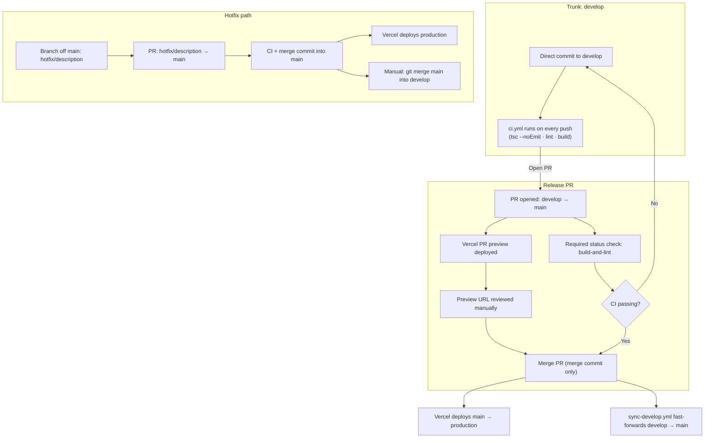

# Contributing to Stetsom Front

Thanks for taking a look at this repository. Stetsom Front is the institutional website and admin CMS for Stetsom. It is developed and maintained by Stetsom's internal engineering team.

This repository is public, but the project is not currently open to external pull requests. There is no obligation to review or merge contributions from outside the team. If you find a bug or have a question, see [Reporting Bugs and Issues](#reporting-bugs-and-issues) below.

The rest of this document covers local setup, coding conventions, and the git flow and release process the team follows.

## Getting Started

See the [README](./README.md) for the stack, project structure, and available commands. For the full local environment setup, including mock data and environment variables, see [`docs/DEVELOP-ENVIRONMENT.md`](./docs/DEVELOP-ENVIRONMENT.md).

Install dependencies and start the dev server:

```bash
pnpm install
pnpm dev
```

## Coding Standards

Stack details, architecture, and coding conventions live in [`CLAUDE.md`](./CLAUDE.md), [`AGENTS.md`](./AGENTS.md), and the rule files under `.agents/rules/`. Read those before making changes. This document does not repeat them.

## Git Flow & Pipeline Overview

This project uses a trunk-based git flow with two permanent branches.

| Branch | Purpose | Deploy |
|--------|---------|--------|
| `main` | Production. Only receives merges from `develop` or hotfix PRs. | Vercel production |
| `develop` | Active development. Commits land here directly. | Vercel dev (mocks) |

No feature branches by default. Commit directly to `develop`. For complex changes, create a short-lived branch off `develop` and open a PR back into `develop`. Treat this as the exception, not the rule.

### Pipeline Overview



Opening the release PR can be done manually, through GitHub's "Compare & pull request" button or `gh pr create`, or with Claude Code's `/release` skill, which validates `develop` and drafts the PR for you. The skill is a shortcut over the manual flow described below, not a separate process.

### Daily Workflow

```bash
git checkout develop
git pull origin develop

# ... implement, commit directly ...
git add .
git commit -m "feat: add new section to home page"
git push origin develop
```

All commits must follow [Conventional Commits](https://www.conventionalcommits.org/): `feat:`, `fix:`, `refactor:`, `chore:`, `docs:`, `style:`, `test:`, `perf:`.

## Releases

When you are ready to ship to production:

1. Confirm `develop` is green: `pnpm tsc --noEmit`, `pnpm lint`, `pnpm build`.
2. Open a pull request from `develop` into `main`, through GitHub's "Compare & pull request" button or:
   ```bash
   gh pr create --base main --head develop --title "<summary>" --body "<what changed>"
   ```
3. Vercel creates a preview deployment automatically for the PR.
4. Review the preview URL and validate the site visually.
5. GitHub blocks the merge button until the required `build-and-lint` CI check passes. This is enforced by branch protection on `main`.
6. Merge the PR using a merge commit.

> If you use code agent, the `/release` skill automates steps 1 and 2: it runs the same validation, drafts the PR title and body, and opens the PR after you confirm. It is a shortcut over the manual steps above, not a separate process.

> The release PR's Vercel preview is content-identical to develop's persistent Vercel preview: both build the same commit against the same mock data. This is not redundant. The preview link lets reviewers validate the release directly on the PR, following GitHub's native review flow, instead of relying on the standing develop URL.

On merge:

- Vercel deploys `main` to production.
- `sync-develop.yml` fast-forwards `develop` to `main`. Branches never diverge.

No extra commits. No manual back-merge. No bot noise.

## Hotfixes

For critical production bugs:

```bash
git checkout main
git pull origin main
git checkout -b hotfix/<description>
# ... fix the bug ...
git add .
git commit -m "fix: <what was broken>"
git push origin hotfix/<description>
```

Open a PR from `hotfix/<description>` into `main`. After merging, backport the fix into `develop`:

```bash
git checkout develop
git pull origin develop
git merge main
git push origin develop
```

> Why the backport is manual: `sync-develop.yml` only fires when a merged PR's `head.ref` is exactly `develop`. That condition holds for release PRs and never holds for `hotfix/<description>` PRs, so the guard correctly skips hotfixes and there is no automatic fast-forward to piggyback on. This is intentional. The common path, releases, is automated. The rare path, hotfixes, stays manual and deliberate so nobody force-pushes over unreleased `develop` work by accident.

## Versioning

Tags are created manually for milestone releases:

```bash
git tag v0.2.0
git push origin v0.2.0
```

## Pull Request Guidelines

The only routine pull request is the release PR from `develop` into `main`, opened manually (GitHub UI or `gh pr create`) or through the `/release` Claude Code skill, which automates the same steps. The PR description follows [`.github/pull_request_template.md`](./.github/pull_request_template.md).

No test runner is configured in this project. Validation before merge relies on type-checking, linting, and a production build.

Before merging a release PR:

- [ ] TypeScript passes (`pnpm tsc --noEmit`)
- [ ] ESLint passes (`pnpm lint`)
- [ ] Build passes (`pnpm build`)
- [ ] Preview URL reviewed and approved
- [ ] No `BREAKING CHANGE` commits without explicit team discussion

The same checks apply to the occasional non-release PR (a short-lived branch off `develop`, per Git Flow above) before merge.

## Reporting Bugs and Issues

This repository does not have issue templates yet. To report a bug or ask a question, open a GitHub issue describing the problem, the steps to reproduce it, and the expected behavior. If you are already in contact with the Stetsom engineering team, reporting directly through that channel works too.

For security vulnerabilities, do not open a public issue. See [`SECURITY.md`](./SECURITY.md).
