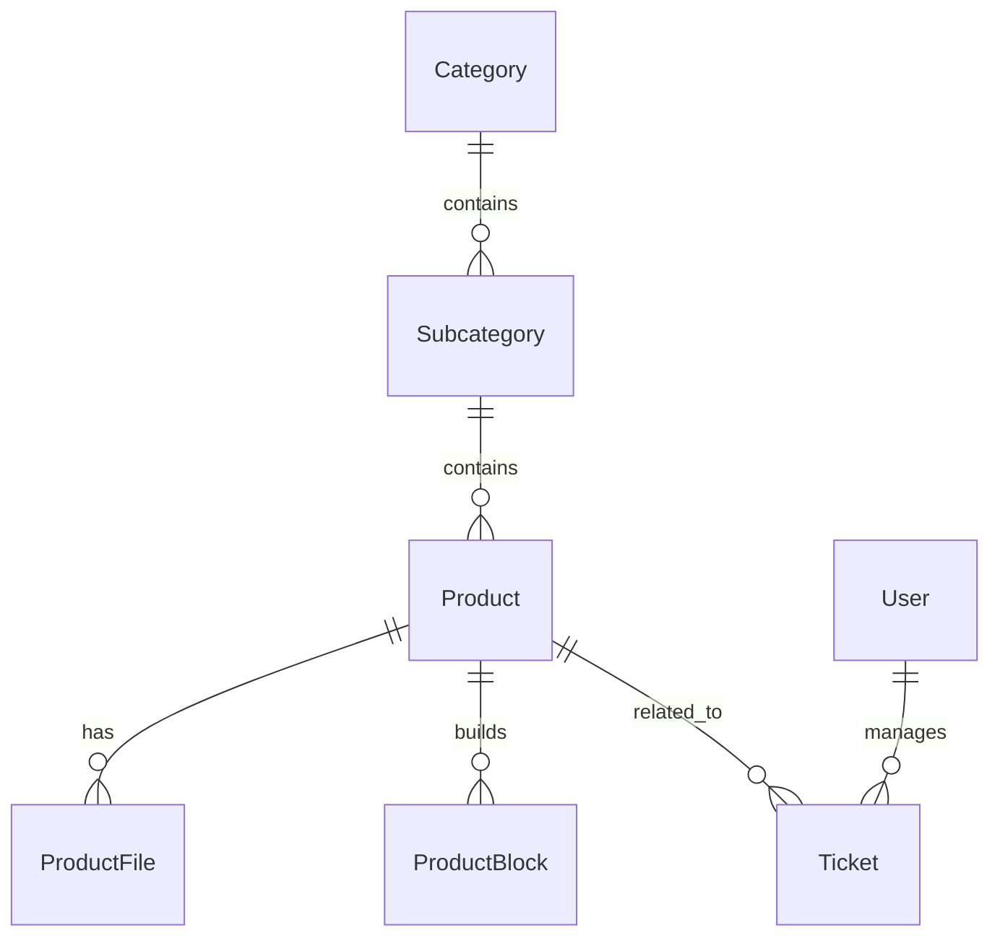

# Product Data Schema

**Autores:** Plaza Creative Collective
**Data:** 10/04/2026
**Status:** Ativo — passível de expansão

---

> **Nota de versionamento:** Este documento representa o design original do schema de dados do CMS Stetsom. À medida que o projeto evolui — especialmente durante a fase de mocks e integração com o backend real — campos, entidades e validações podem ser adicionados, revisados ou removidos. Sempre que uma mudança for necessária, atualize este documento. O contrato TypeScript vigente em `src/lib/api/contracts.ts` é a fonte de verdade para o frontend.

---

## 1. Visão Geral

O **Product Data Schema** define a estrutura de dados central do CMS Stetsom, responsável por armazenar produtos, categorias, arquivos, blocos de página (page builder) e metadados relacionados.

A modelagem foi construída com base em:

- Modularidade (produtos com blocos dinâmicos);
- Escalabilidade (futura integração ao BOS);
- Clareza e rastreabilidade (logs, datas e autores).

---

## 2. Entidades Principais

### 2.1. `Product`

| Campo | Tipo | Descrição |
|---|---|---|
| `id` | `uuid` | Identificador único do produto |
| `name` | `string` | Nome comercial do produto |
| `slug` | `string` | Slug amigável para URL (gerado automaticamente) |
| `category_id` | `uuid` | Referência à categoria principal |
| `subcategory_id` | `uuid` | Referência à subcategoria (opcional) |
| `status` | `enum('ACTIVE', 'DISCONTINUED')` | Define se o produto está em linha ou fora de linha |
| `launch_date` | `timestamp` | Data de lançamento do produto |
| `description` | `text` | Descrição curta do produto |
| `specifications` | `jsonb` | Lista chave/valor com especificações técnicas |
| `thumbnail_url` | `string` | Imagem de destaque principal |
| `video_url` | `string` | Link de vídeo (YouTube ou Vimeo) |
| `created_at` | `timestamp` | Data de criação |
| `updated_at` | `timestamp` | Data de atualização |
| `created_by` | `uuid` | Usuário que criou o registro |

**Relações**

- 1:N → `ProductBlock` (blocos de página)
- 1:N → `ProductFile` (manuais, PDFs, imagens, etc.)
- N:1 → `Category`
- N:1 → `Subcategory`

---

### 2.2. `Category`

| Campo | Tipo | Descrição |
|---|---|---|
| `id` | `uuid` | Identificador único |
| `name` | `string` | Nome da categoria |
| `slug` | `string` | Slug amigável |
| `order` | `int` | Ordem de exibição |
| `created_at` | `timestamp` | Data de criação |
| `updated_at` | `timestamp` | Data de atualização |

**Relações**

- 1:N → `Subcategory`
- 1:N → `Product`

---

### 2.3. `Subcategory`

| Campo | Tipo | Descrição |
|---|---|---|
| `id` | `uuid` | Identificador único |
| `category_id` | `uuid` | Referência à categoria |
| `name` | `string` | Nome da subcategoria |
| `slug` | `string` | Slug amigável |
| `order` | `int` | Ordem de exibição |
| `created_at` | `timestamp` | Data de criação |
| `updated_at` | `timestamp` | Data de atualização |

---

### 2.4. `ProductBlock` (Page Builder)

Estrutura modular que define os blocos de conteúdo de cada página de produto.

| Campo | Tipo | Descrição |
|---|---|---|
| `id` | `uuid` | Identificador único do bloco |
| `product_id` | `uuid` | Referência ao produto |
| `type` | `enum('IMAGE', 'VIDEO', 'HTML', 'MODEL3D', 'TEXT')` | Tipo de bloco |
| `order` | `int` | Ordem de exibição na página |
| `data` | `jsonb` | Dados específicos do bloco (ver abaixo) |
| `created_by` | `uuid` | Usuário responsável |
| `created_at` | `timestamp` | Data de criação |
| `updated_at` | `timestamp` | Última atualização |

**Estrutura de `data` por tipo:**

```json
// type = "IMAGE"
{
  "images": ["url1", "url2"],
  "caption": "Galeria de imagens",
  "layout": "full"
}

// type = "VIDEO"
{
  "video_url": "https://youtube.com/...",
  "title": "Apresentação",
  "description": "Demonstração técnica"
}

// type = "HTML"
{
  "html": "<div>Conteúdo livre</div>",
  "css_class": "custom-section"
}

// type = "MODEL3D"
{
  "file_url": "https://cdn.stetsom.com/model.glb",
  "background": "#000",
  "scale": 1.0
}

// type = "TEXT"
{
  "title": "Descrição técnica",
  "content": "<p>Texto em rich text</p>",
  "align": "left"
}
```

---

### 2.5. `ProductFile`

| Campo | Tipo | Descrição |
|---|---|---|
| `id` | `uuid` | Identificador único |
| `product_id` | `uuid` | Referência ao produto |
| `file_url` | `string` | Caminho do arquivo |
| `type` | `enum('MANUAL', 'CATALOG', 'CERTIFICATE', 'IMAGE', 'OTHER')` | Tipo do arquivo |
| `version` | `int` | Versão do arquivo |
| `is_active` | `boolean` | Indica se o arquivo está ativo |
| `created_at` | `timestamp` | Data de upload |
| `updated_at` | `timestamp` | Data da última modificação |

---

### 2.6. `User`

| Campo | Tipo | Descrição |
|---|---|---|
| `id` | `uuid` | Identificador único |
| `name` | `string` | Nome completo |
| `email` | `string` | E-mail corporativo |
| `role` | `enum('ADMIN', 'SAC', 'COMMERCIAL', 'ARTS')` | Tipo de usuário |
| `password_hash` | `string` | Senha criptografada |
| `created_at` | `timestamp` | Data de criação |
| `last_login` | `timestamp` | Último acesso |

---

### 2.7. `Ticket`

| Campo | Tipo | Descrição |
|---|---|---|
| `id` | `uuid` | Identificador do ticket |
| `user_id` | `uuid` | Usuário interno responsável |
| `product_id` | `uuid` | Produto relacionado (opcional) |
| `status` | `enum('OPEN', 'IN_PROGRESS', 'CLOSED')` | Estado atual do ticket |
| `subject` | `string` | Assunto resumido |
| `message` | `text` | Conteúdo da mensagem original |
| `tags` | `string[]` | Lista de tags associadas |
| `history` | `jsonb` | Registro de atualizações e respostas |
| `created_at` | `timestamp` | Data de criação |
| `updated_at` | `timestamp` | Data de atualização |

---

### 2.8. `Representative`

| Campo | Tipo | Descrição |
|---|---|---|
| `id` | `uuid` | Identificador único |
| `name` | `string` | Nome do representante |
| `region` | `string` | Região de atuação |
| `email` | `string` | E-mail |
| `phone` | `string` | Telefone |
| `website` | `string` | Site (opcional) |
| `cep` | `string` | CEP de referência |
| `created_at` | `timestamp` | Data de criação |

---

### 2.9. `TechnicalAssistance`

| Campo | Tipo | Descrição |
|---|---|---|
| `id` | `uuid` | Identificador único |
| `name` | `string` | Nome da assistência |
| `address` | `string` | Endereço completo |
| `email` | `string` | E-mail |
| `phone` | `string` | Telefone |
| `specialty` | `string` | Tipo de serviço / área técnica |
| `created_at` | `timestamp` | Data de criação |

---

## 3. Relacionamentos



---

## 4. Regras e Validações de Dados

- `Product.name` deve ser único dentro de uma categoria.
- `ProductBlock.order` deve ser sequencial e único por produto.
- Cada produto deve possuir **ao menos um bloco ativo** (imagem, texto ou vídeo).
- `ProductFile.version` incrementa automaticamente a cada novo upload de mesmo tipo.
- `Ticket.history` deve armazenar logs de status e mensagens internas.
- Deleções devem ser **soft delete** para manter histórico (`deleted_at` opcional).

---

## 5. Considerações Técnicas

- Banco recomendado: **PostgreSQL** com campos `jsonb` para flexibilidade de blocos.
- Uploads devem ser armazenados via **CDN (S3/Cloudflare R2)**.
- Indexação de texto (`GIN`) para busca em `Product.name`, `description` e `specifications`.
- Utilizar **UUID v4** como chave primária.
- Suporte a **versionamento de schema via Prisma Migrate**.
- Garantir isolamento por módulo e logging no backend (para auditoria LGPD).

---

## 6. Histórico de Revisões

| Data | Versão | Descrição | Autor |
|---|---|---|---|
| 10/04/2026 | 1.0 | Criação do documento original | Plaza Creative Collective |
| 15/05/2026 | 1.1 | Conversão para Markdown; nota de extensibilidade adicionada | claude-sonnet-4-6 |

---

## 7. Divergências Conhecidas (Frontend × Schema Original)

Durante o desenvolvimento do frontend, algumas adaptações foram necessárias antes do backend estar disponível. Estas divergências estão documentadas aqui para facilitar a reconciliação futura:

- **Mocks**: Os dados de mock em `src/lib/mock/` seguem a forma serializada JSON (datas como `string` ISO 8601, IDs como `string` UUID), não os tipos nativos do banco (`timestamp`, `uuid`).
- **`specifications`**: O frontend trata `specifications` como `Record<string, string | number>`. O backend pode ter validações mais rígidas sobre as chaves permitidas.
- **Campos opcionais**: Campos como `subcategory_id`, `video_url` e `website` são tratados como `undefined` no TypeScript — confirmar com o backend se retornam `null` ou são omitidos na resposta.

Qualquer nova divergência identificada deve ser registrada nesta seção.
